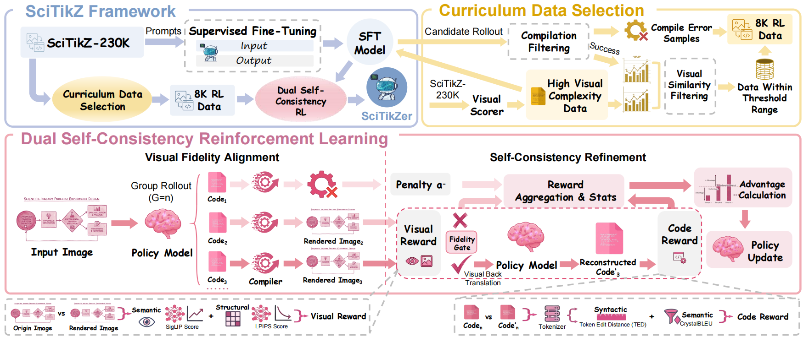
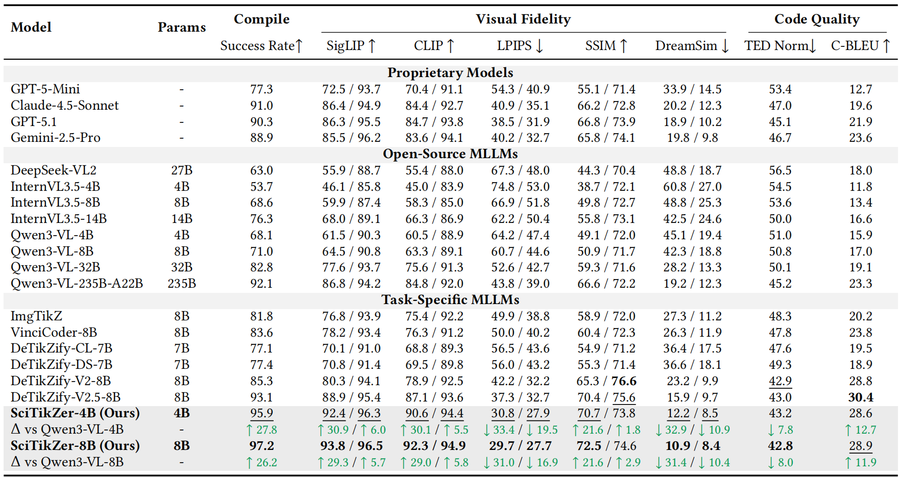
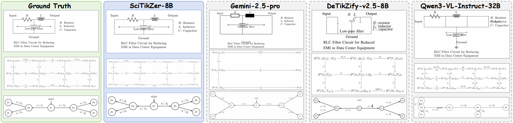

<h1 align="center">
Scientific Graphics Program Synthesis via Dual Self-Consistency Reinforcement Learning
</h1>


<p align="center">
  <b>Juekai Lin</b><sup>1,2</sup>,
  <b>Yun Zhu</b><sup>2</sup>,
  <b>Honglin Lin</b><sup>2,3</sup>,
  <b>Sijing Li</b><sup>1</sup>,
  <b>Tianwei Lin</b><sup>1</sup>,
  <b>Zheng Liu</b><sup>2,4</sup>,
  <b>Xiaoyang Wang</b><sup>2</sup>,
  <b>Wenqiao Zhang</b><sup>1</sup>,
  <b>Lijun Wu</b><sup>2</sup>
</p>

<p align="center">
  <sup>1</sup>Zhejiang University &nbsp;&nbsp;
  <sup>2</sup>Shanghai Artificial Intelligence Laboratory, OpenDataLab &nbsp;&nbsp;
  <sup>3</sup>Shanghai Jiao Tong University &nbsp;&nbsp;
  <sup>4</sup>Peking University
</p>

<p align="center">
  <a href="https://arxiv.org/abs/2604.06079">
    
  </a>
  <a href="https://huggingface.co/collections/JackieLin0123/scitikz">
    
  </a>
  <a href="https://github.com/JackieLin0123/SciTikZ">
    
  </a>
</p>

🎉🎉🎉 SciTikZ is accepted by ACM MM 2026!

## 📌Introduction

This repository provides the implementation, data processing, training, and evaluation code for **SciTikZ**, a framework for synthesizing executable LaTeX/TikZ code from scientific graphics images.

Scientific graphics program synthesis is challenging because TikZ requires precise coordinates, explicit symbolic primitives, strict package dependencies, and compilable code structure. To address these challenges, we introduce **Dual Self-Consistency Reinforcement Learning (DSC-RL)**, a closed-loop training framework that improves both visual fidelity and structural code quality through executable render-and-verify feedback.

<p align="center">
  
</p>

## 🧠Overview

The core contribution of this work is a dual self-consistency reinforcement learning framework for image-to-TikZ program synthesis. The framework integrates three complementary reward signals.

#### ✅Compilation Reward

Generated LaTeX/TikZ code is first compiled in a sandbox environment. Successfully compiled code receives a positive reward, while invalid or non-executable code is penalized. This encourages the model to generate complete, self-contained, and compilable TikZ programs.

#### 👁️Visual Consistency Reward

For successfully compiled code, the rendered image is compared with the input scientific graphic. We use:

- **SigLIP** for high-level semantic alignment.
- **LPIPS** for low-level structural and perceptual similarity.

This reward guides the model toward producing code that renders visually faithful scientific diagrams.

#### 🔁Code Self-Consistency Reward

To improve structural robustness and reduce visually plausible but degenerate code, we introduce a round-trip self-consistency mechanism:

```text
Input Image → Generated TikZ Code → Rendered Image → Reconstructed TikZ Code
```

The generated code and reconstructed code are compared using:

- **Token Edit Distance (TED)** for structural similarity.
- **CrystalBLEU** for semantic code similarity while reducing boilerplate bias.

This encourages the model to generate TikZ code that is not only visually accurate but also structurally stable, editable, and reusable.

## 📊Main Results

<p align="center">
  
</p>

SciTikZer achieves strong performance on scientific graphics program synthesis, improving both compilation success rate and visual fidelity compared with general-purpose MLLMs and task-specific Image-to-TikZ baselines.

## 🖼️Qualitative Examples

<p align="center">
  
</p>

The qualitative examples show that SciTikZer better preserves geometric layout, symbolic structures, and fine-grained spatial relations in complex scientific graphics.  

## 📚Citation

If you find this work useful, please cite:

```bibtex
@misc{lin2026scientificgraphicsprogramsynthesis,
  title         = {Scientific Graphics Program Synthesis via Dual Self-Consistency Reinforcement Learning},
  author        = {Juekai Lin and Yun Zhu and Honglin Lin and Sijing Li and Tianwei Lin and Zheng Liu and Xiaoyang Wang and Wenqiao Zhang and Lijun Wu},
  year          = {2026},
  eprint        = {2604.06079},
  archivePrefix = {arXiv},
  primaryClass  = {cs.CV},
  url           = {https://arxiv.org/abs/2604.06079}
}
```

## 🙏Acknowledgments

We thank the developers of EasyR1, verl, LLaMA-Factory, Hugging Face Transformers, CrystalBLEU, LPIPS, SigLIP, and related open-source tools for providing the infrastructure and evaluation components used in this work.
